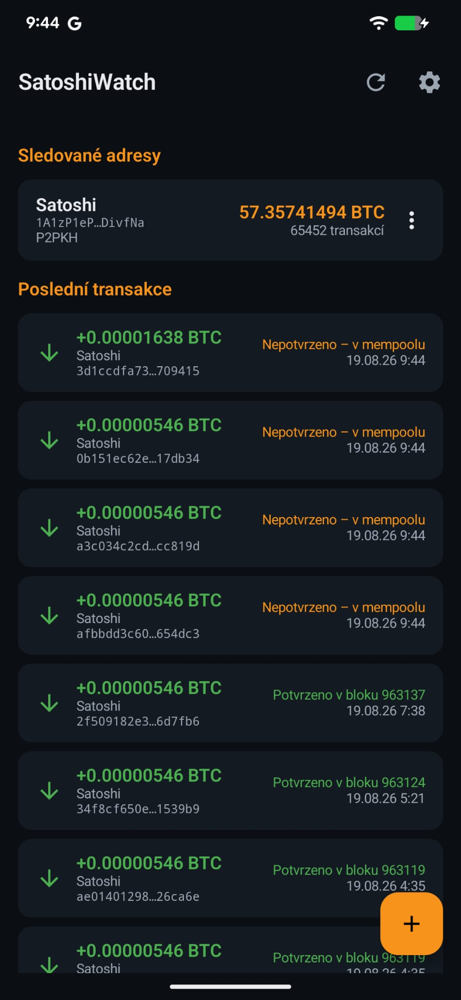
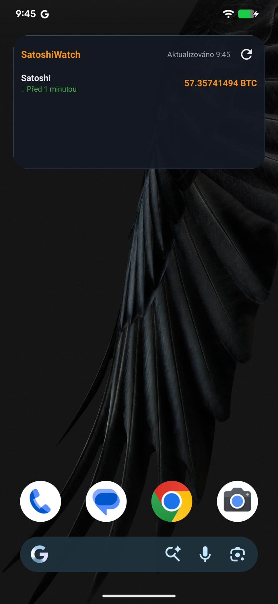
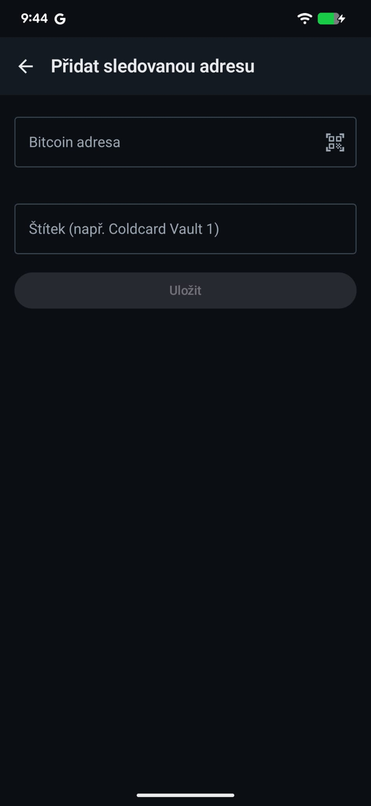
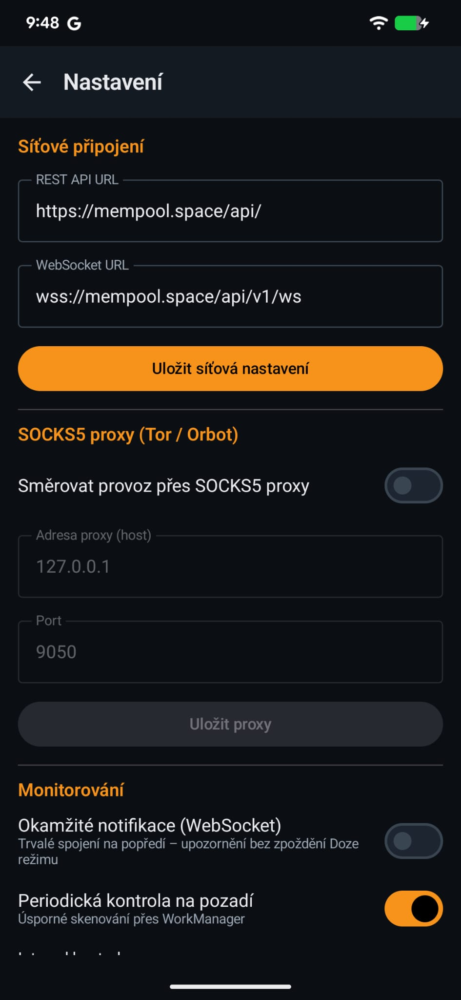
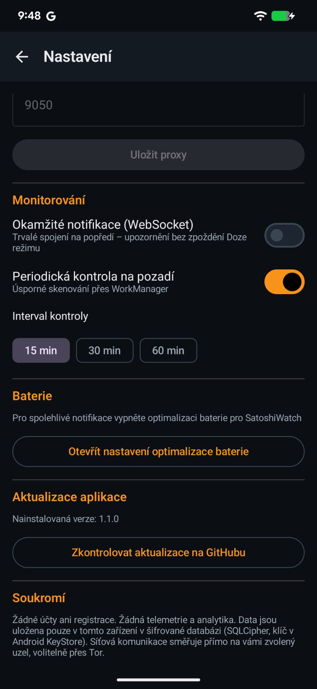

# SatoshiWatch

**[English](#english)** | **[Česky](#česky)**

  
  
  
  
  

---

## English

Fully anonymous **watch-only Bitcoin address monitor** for Android. It passively
watches your cold-storage addresses (Coldcard, Trezor, …) and alerts you the
moment funds move in — or out. No private keys, no accounts, no telemetry.

### 📥 Download

**[⬇️ SatoshiWatch-1.2.0-debug.apk](https://github.com/Topkadas/SatoshiWatch/raw/main/dist/SatoshiWatch-1.2.0-debug.apk)** (36 MB, Android 8.0+)

Install: download the APK on your phone → open it → allow installs from unknown
sources. This is a debug build signed with a development key; since the project
is open source, you can always build a verified APK yourself
(`./gradlew assembleDebug`). Updates can be installed directly from the app
(Settings → App updates) with SHA-256 verification.

### Features

- **Instant alerts** for incoming and OUTGOING transactions (critical alarm —
  if your vault ever moves, you know within seconds, first in mempool, then on
  confirmation with block height)
- **Hybrid monitoring**: battery-friendly periodic checks (WorkManager,
  15/30/60 min) + optional realtime WebSocket foreground service
- **Home-screen widget (4×2)**: up to 3 addresses with balance, last movement
  direction and time, manual refresh button
- **On-device address validation** with full checksums: Legacy (P2PKH), Nested
  SegWit (P2SH), Native SegWit (bc1q), Taproot (bc1p) — BIP-173/350 test vectors
  covered by unit tests
- **QR scanning** via CameraX + ZXing (pure offline decoder)
- **Three languages**: English, Czech, German — switchable in Settings
- **In-app updates from this repo**: manual check, download through the app's
  own HTTP client (honors Tor proxy), SHA-256 verification before install

### Privacy & security

| Principle | Implementation |
|---|---|
| Zero registration | No logins, e-mails, or device identifiers |
| Local storage only | Room + **SQLCipher** (AES-256); random passphrase wrapped by an **Android KeyStore** key |
| Encrypted settings | `EncryptedSharedPreferences` (AES-256-GCM/SIV) |
| Network privacy | Direct connection to a configurable node; defaults `https://mempool.space/api` + `wss://mempool.space/api/v1/ws`; optional **SOCKS5 proxy** (Orbot/Tor) — DNS resolves inside the proxy (no DNS leak) |
| Zero telemetry | No Firebase/Analytics/Sentry; third-party deps are only OkHttp, Retrofit, SQLCipher, ZXing. ML Kit was deliberately avoided: its SDK uploads diagnostics to Google outside the app's HTTP client, i.e. outside the Tor proxy |
| Backups | `allowBackup=false` + full `data_extraction_rules` excludes — nothing leaves the device |
| Cleartext | Denied, except `.onion` (mempool onion instances run over http inside Tor) |
| Lock screen | Notifications carry a `publicVersion` without amounts or addresses |

### Build

1. Android Studio → *Open* → project folder (JDK 17; the Gradle wrapper is included).
2. `./gradlew :app:assembleDebug` / `:app:testDebugUnitTest`
3. minSdk 26, targetSdk 34. Stack: Kotlin, Jetpack Compose (Material 3), Hilt,
   Room + SQLCipher, Retrofit/OkHttp, WorkManager, CameraX + ZXing.

### Tor / your own node

- **Orbot**: Settings → SOCKS5 proxy → `127.0.0.1:9050`; you can point the URLs
  at a mempool onion instance (`http://…onion/api`).
- **Own node** (Umbrel, myNode, RaspiBlitz with the mempool app):
  `http://umbrel.local:3006/api` — note that outside `.onion`, https is required.

---

## Česky

Plně anonymní **watch-only monitor bitcoinových adres** pro Android. Pasivně hlídá
trezorové adresy (Coldcard, Trezor, …) a okamžitě upozorní na příchozí i odchozí
transakce — bez privátních klíčů, bez účtů, bez telemetrie.

### 📥 Stažení

**[⬇️ SatoshiWatch-1.2.0-debug.apk](https://github.com/Topkadas/SatoshiWatch/raw/main/dist/SatoshiWatch-1.2.0-debug.apk)** (36 MB, Android 8.0+)

Instalace: stáhni APK do telefonu → otevři → povol instalaci z neznámých zdrojů.
Jde o debug build podepsaný vývojovým klíčem; ověřený build si můžeš kdykoli
zkompilovat sám ze zdrojáků (`./gradlew assembleDebug`) — proto je projekt open
source. Aktualizace jdou instalovat přímo z aplikace (Nastavení → Aktualizace
aplikace) s ověřením SHA-256.

### Funkce

- **Okamžité výstrahy** na příchozí i ODCHOZÍ transakce (kritický alarm — pohne-li
  se trezor, víš to během vteřin: nejdřív mempool, pak potvrzení s výškou bloku)
- **Hybridní monitorování**: úsporná periodická kontrola (WorkManager, 15/30/60 min)
  + volitelná realtime WebSocket služba na popředí
- **Widget na plochu (4×2)**: až 3 adresy se zůstatkem, směrem a časem posledního
  pohybu, tlačítko ručního obnovení
- **Validace adres v zařízení** včetně kontrolních součtů: Legacy (P2PKH), Nested
  SegWit (P2SH), Native SegWit (bc1q), Taproot (bc1p) — BIP-173/350 vektory
  pokryté unit testy
- **Skenování QR** přes CameraX + ZXing (čistě offline dekodér)
- **Tři jazyky**: čeština, angličtina, němčina — přepínač v Nastavení
- **Aktualizace přímo z tohoto repa**: ruční kontrola, stažení přes aplikačního
  klienta (respektuje Tor proxy), ověření SHA-256 před instalací

### Bezpečnostní principy

| Princip | Implementace |
|---|---|
| Nulová registrace | Žádné přihlašování, e-maily ani identifikátory zařízení |
| Lokální úložiště | Room + **SQLCipher** (AES-256), passphrase náhodná, zabalená klíčem v **Android KeyStore** |
| Šifrovaná nastavení | `EncryptedSharedPreferences` (AES-256-GCM/SIV) |
| Síťové soukromí | Přímé spojení na konfigurovatelný uzel; výchozí `https://mempool.space/api` + `wss://mempool.space/api/v1/ws`; volitelná **SOCKS5 proxy** (Orbot/Tor) — DNS se řeší až v proxy (žádný DNS únik) |
| Nulová telemetrie | Žádný Firebase/Analytics/Sentry; závislosti třetích stran jen OkHttp, Retrofit, SQLCipher, ZXing. ML Kit záměrně vynechán — jeho SDK odesílá diagnostiku na Google mimo aplikačního klienta, tedy i mimo Tor |
| Zálohy | `allowBackup=false` + kompletní `data_extraction_rules` — nic neopouští zařízení |
| Cleartext | Zakázán; výjimka jen pro `.onion` |
| Zamčená obrazovka | Notifikace mají `publicVersion` bez částek a adres |

### Sestavení

1. Android Studio → *Open* → složka projektu (JDK 17; Gradle wrapper je součástí).
2. `./gradlew :app:assembleDebug` / `:app:testDebugUnitTest`
3. minSdk 26, targetSdk 34. Stack: Kotlin, Jetpack Compose (Material 3), Hilt,
   Room + SQLCipher, Retrofit/OkHttp, WorkManager, CameraX + ZXing.

### Tor / vlastní uzel

- **Orbot**: Nastavení → SOCKS5 proxy → `127.0.0.1:9050`; URL lze přepnout na
  onion adresu mempool instance (`http://…onion/api`).
- **Vlastní uzel** (Umbrel, myNode, RaspiBlitz s mempool aplikací):
  `http://umbrel.local:3006/api` — pozor, mimo `.onion` vyžaduje https.

### Historie verzí

- **1.2.0** — tři jazyky (cs/en/de) s přepínačem v Nastavení; lokalizované
  notifikace, widget i chybové hlášky
- **1.1.0** — widget na plochu; aktualizace aplikace přímo z GitHubu (SHA-256)
- **1.0.0** — první vydání: monitoring, notifikace, QR sken, Tor, SQLCipher
